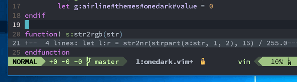

# airline-onedark.vim

airline.vim theme for use with [geoffharcourt/onedark.vim](https://github.com/geoffharcourt/one-dark.vim) 



**Currently, this theme works on only GUI Vim**

## Install

### Pathogen (Linux)

```vimL
git clone https://github.com/retorillo/airline-onedark.vim.git ~/.vim/bundle/airline-onedark.vim
```
### Pathogen (Windows/PowerShell)

```vimL
git clone https://github.com/retorillo/airline-onedark.vim.git $home/vimfiles/bundle/airline-onedark.vim
```

### .vimrc

```vimL
let g:airline_theme='onedark'
```

## Options

```vimL
" Offset hue(HSV) of theme colors between -1.0 and 1.0 (By default, 0.0)
let g:airline#themes#onedark#hue = 0
" Offset saturation(HSV) of theme colors between -1.0 and 1.0 (By default, -0.05)
let g:airline#themes#onedark#saturation = -0.05
" Offset value(HSV) of theme colors between -1.0 and 1.0 (By default, 0.0)
let g:airline#themes#onedark#value = 0
```

## License

Copyright (C) 2016 Retorillo
Distributed under the MIT License
